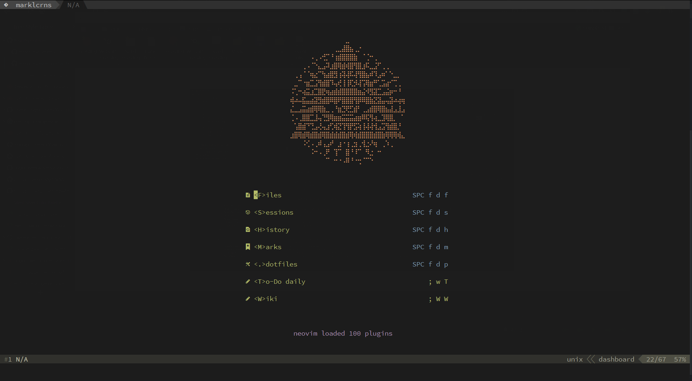
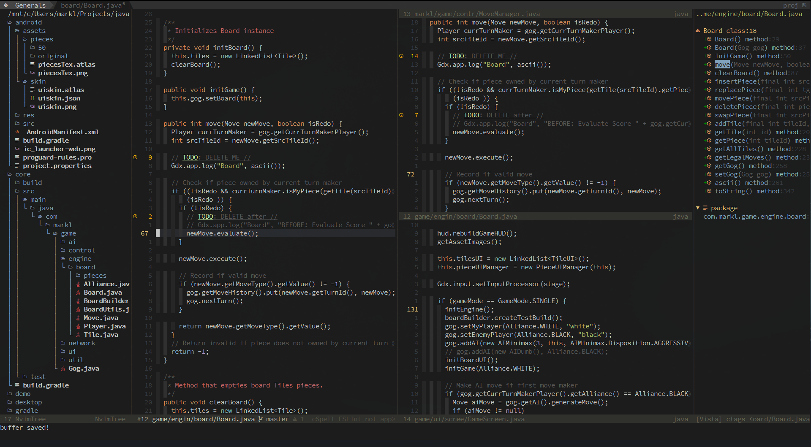
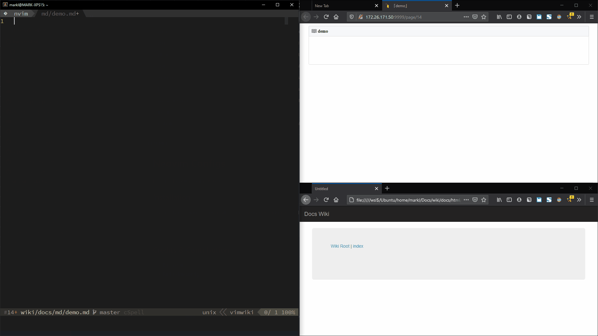

# Neovim Configs

⚡ Fast startup, lazy-loaded plugins, and featureful Neovim configurations made
with obsession 🤤 and ❤





[Hybrid](https://github.com/rafi/vim-config/blob/master/themes/hybrid.vim)
colorscheme, statusline and tabline by [rafi](https://github.com/rafi)

## Requirements

- Neovim 0.5+
- Python 3+
- Python 2+ (Optional but required for taskwiki.vim)
- Nodejs and npm
- yarn (Optional for markdown-preview.vim)
- cargo (Optional for minimap.vim)

## Installation

Just simply run `make` to install all the necessary dependencies and directories

```bash
make
# or
make install
```

This will install all dependencies and create `env` python virtual environment
in root directory for `python_host_prog` and `python3_host_prog` instead of
using global python.

### Vimwiki

A powerful wiki creator for all sorts of needs.



[Demo](https://marklcrns.github.io/wiki/docs/html/index.html) Wiki with custom
css and [wiki2html script](https://github.com/marklcrns/nvim-config/blob/master/config/plugins/wiki2html.sh)

### Taskwiki

Task warrior and Vimwiki integration


### UltiSnips

[honza/vim-snippets](https://github.com/honza/vim-snippets) will automatically
be installed which contains various community-maintained programming languages
snippets.

Additionally, UltiSnips is configured to source custom personal snippets from
`$HOME/.vim/UltiSnips` directory.

Run `:UltiSnipsEdit!` in vim command line to edit all snippets for the current
buffer filetype

- [My personal UltiSnips snippets](https://github.com/marklcrns/ultisnips-snippets)

<br>
<br>

## Credits

Thanks to the following (Neo)Vim configurations and to all the geniuses behind
the plugins that made this repo possible.

- [ThinkVim](https://github.com/hardcoreplayers/ThinkVim)
- [Rafi's vim-config](https://github.com/rafi/vim-config)
- [66RING's .vim](https://github.com/66RING/.vim)

