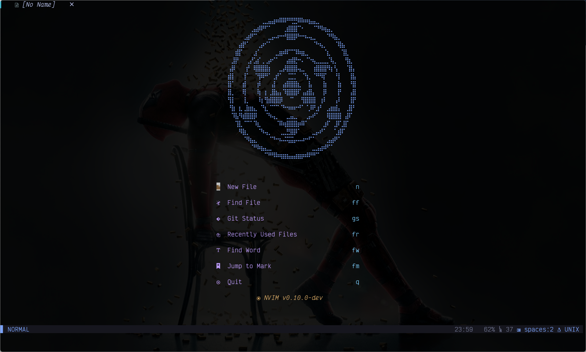

# Neovim Config

⚡ Fast startup, lazy-loaded plugins, and featureful Neovim configurations made
with pure obsession and ❤


## Startup Time

~ 100ms

## Features

- [x] Lazy loading (lazy.nvim)
- [x] LSP (servers are auto-installed as needed)
    - Mason, null-ls, and nvim-lspconfig are used to configure LSP
- [x] Treesitter
- [x] Telescope
- [x] Vimwiki
- [x] Markdown preview
- [x] Git integration
- [x] Autocomplete
    - [x] nvim-cmp
    - [x] UltiSnips
- [x] Split auto-resize (focus.nvim)
- [x] Dashboard (alpha-nvim)
- [x] Statusline (feline.nvim)
- [x] Tabline (bufferline.nvim)
- [x] File explorer (neo-tree.nvim)
- [X] Diff (diffview.nvim)

and many more...

## Requirements
- Neovim 0.9+
- Nodejs and npm
- Python 3+
- pandoc (Required for vimwiki)
- yarn (Required for markdown-preview.vim)

## Installation

Clone repository into `~/.config/nvim`

```bash
git clone --recurse-submodules --ff-only --branch master https://github.com/marklcrns/nvim-config ~/.config/nvim
```

Then simply run `make` to install all the necessary dependencies and
directories.

```bash
cd ~/.config/nvim

make
# or
make install
```

This will install all dependencies and create `env` python virtual environment
in root directory for `python_host_prog` and `python3_host_prog` instead of
using global python.

## Preview

Colorscheme: [tokyonight](https://github.com/folke/tokyonight.nvim)


Dashboard with [alpha-nvim](https://github.com/goolord/alpha-nvim) that changes
according to terminal screen size.

<div>
    <a id="alpha_xl">
        
    </a>
    <a id="alpha_l">
        
    </a>
</div>

<div>
    <a id="alpha_m">
        
    </a>
    <a id="alpha_s">
        
    </a>
</div>

## Notable Plugins

### Vimwiki

A powerful personal wiki creator for all sorts of needs.

- [vimwiki/vimwiki](https://github.com/vimwiki/vimwiki)


[Demo](https://marklcrns.github.io/wiki/docs/html/index.html) Wiki with custom
css and [wiki2html script](https://github.com/marklcrns/nvim-config/blob/master/config/plugins/wiki2html.sh)

### UltiSnips

[honza/vim-snippets](https://github.com/honza/vim-snippets) will automatically
be installed which contains various community-maintained programming languages
snippets.

Additionally, UltiSnips is configured to source custom personal snippets from
`$VIM_PATH/UltiSnips` directory.

Run `:UltiSnipsEdit!` in vim command line to edit all snippets for the current
buffer filetype

- [My personal UltiSnips snippets](https://github.com/marklcrns/ultisnips-snippets)

### Vim-Smartq

Shameless plug to my own plugin
[vim-smartq](https://github.com/marklcrns/vim-smartq) which lets you bind your
key `q` to smartly close the current buffer, split, tab, or floating window
without having to remember/define different keybindings for each. It also
preserves tab splits and auto-close empty buffers.


<br>

## Special Thanks

Most of my configuration piggy backed from other people's configurations.

- [sindrets' nvim config](https://github.com/sindrets/dotfiles/tree/master/.config/nvim)
- [NvChad/NvChad](https://github.com/NvChad/NvChad)

### Inspiration

- [rafi/vim-config](https://github.com/rafi/vim-config)

